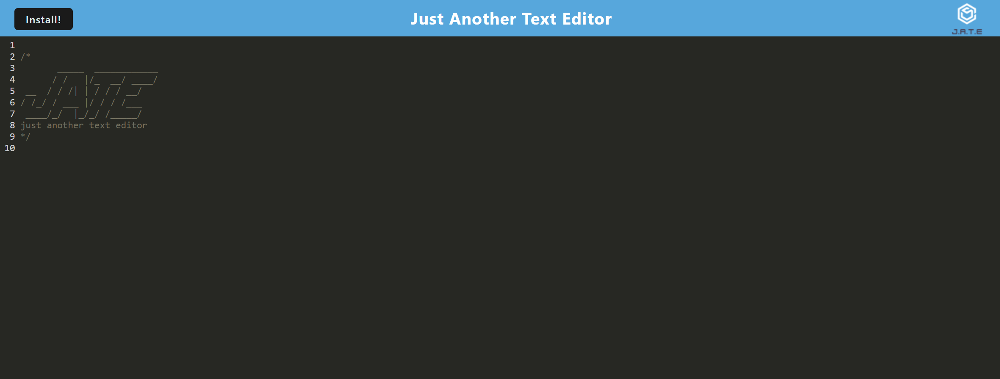
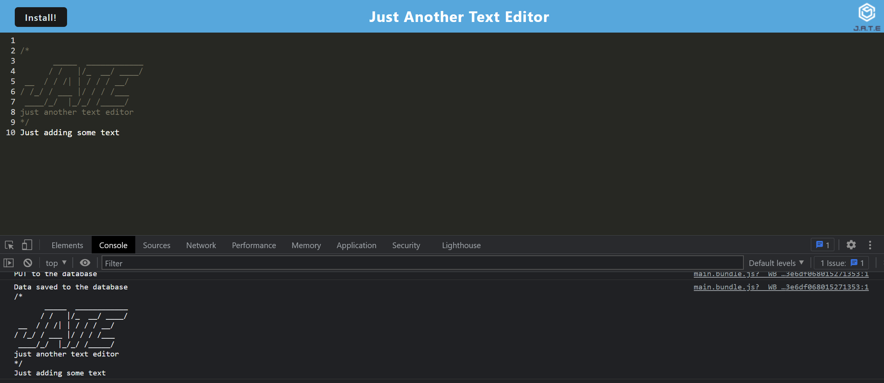
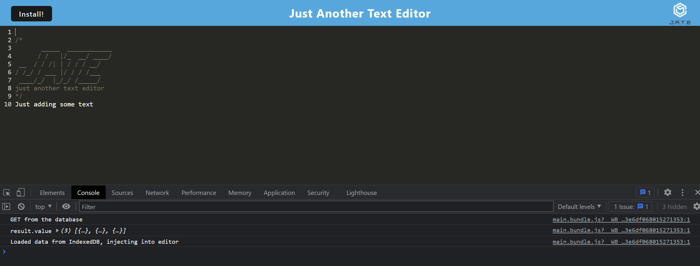
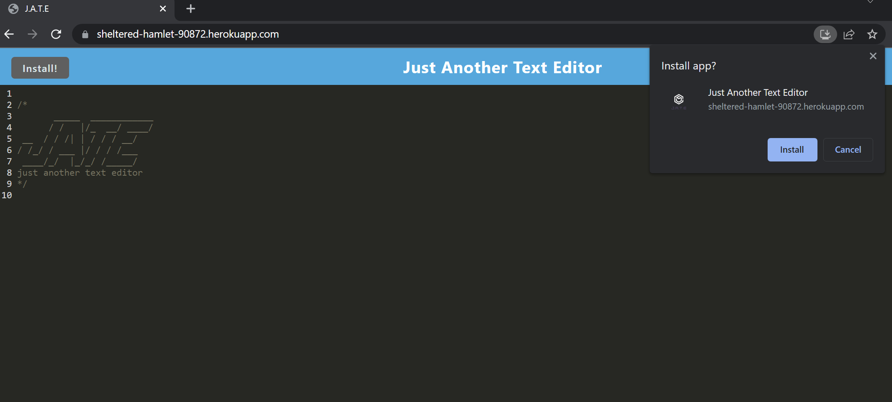
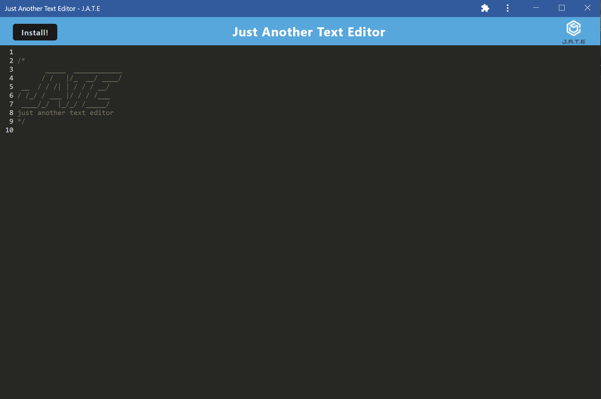

# TypeAway-TE
TypeAway is a simple text editor that remains completely functional offline, it is also my first foray into PWAs.

It uses a host of technologies such as IndexedDB, WebPack, and Workbox to name a few.

Here's a link to the deployed site: https://typeaway.onrender.com

## ScreenShots
This is the page on load without any edits.

Here is the console log of the text stored to the db when clicking off of the window.

Here is the console log on initial page load after closing the app. New text intact!

As it as PWA it can be installed as such.

Here is the editor when opened as a standalone.

